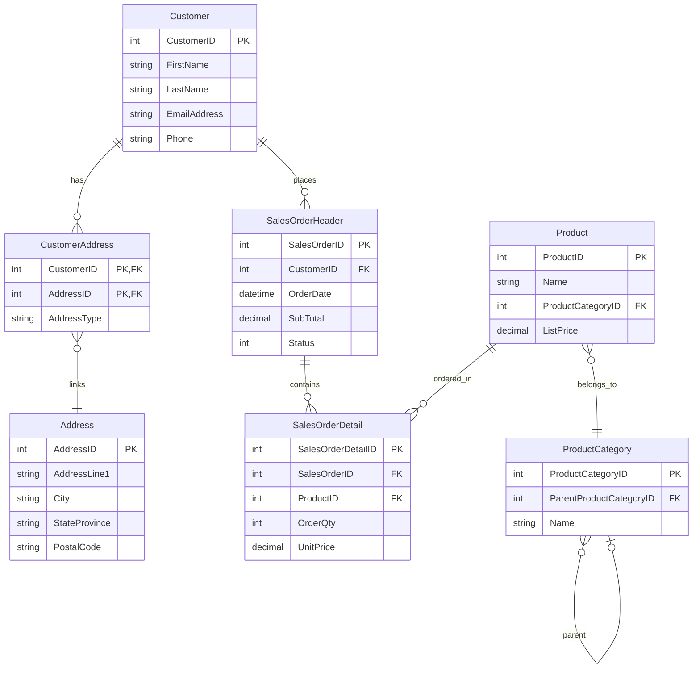

# AdventureWorksLT Data Simulator

[](https://opensource.org/licenses/MIT)
[](https://www.terraform.io/)
[](https://azure.microsoft.com/)

Deploy a **live, self-updating AdventureWorksLT database** on Azure with Terraform. Useful for:

- **Change Data Capture (CDC)** exercises
- **Streaming pipelines** and real-time data
- **Incremental loading** patterns
- **ETL/ELT** practice

📝 **[Read the full blog post on Medium](https://stefanko-ch.medium.com/building-a-live-data-simulator-for-data-engineering-practice-10d924720492)**

> **⚠️ WARNING**
> 
> This setup is for **DEMO/LEARNING only**. Don't use it in production!
> 
> The SQL Server firewall is wide open (`0.0.0.0-255.255.255.255`), there are no VNets, and it uses basic security. Good enough for testing CDC/streaming pipelines, but lock it down properly if you need something production-grade.

## Overview

This project deploys:

1. **Azure SQL Database** with the AdventureWorksLT sample data
2. **SQL Users** (dbwriter, dbreader) - automatically created!
3. **6 Stored Procedures** for simulation - automatically created!
4. **5 Logic Apps** that simulate realistic business activity every 5 minutes:
   - Generate new orders (100 orders/cycle)
   - Ship pending orders (~50%)
   - Update customer information (20 customers)
   - Create new customers (10-20)
   - Cancel random orders (~10%)

Everything runs automatically via Terraform - no manual SQL setup needed.

## About AdventureWorksLT

[AdventureWorksLT](https://learn.microsoft.com/en-us/sql/samples/adventureworks-install-configure) is Microsoft's lightweight sample database for a fictional bicycle company. It's built into Azure SQL Database as a sample dataset option.

**Schema Overview:**
- **SalesLT.Customer** - Customer information (name, email, phone)
- **SalesLT.Address** - Physical addresses
- **SalesLT.CustomerAddress** - Links customers to addresses
- **SalesLT.Product** - Product catalog (bikes, components, accessories)
- **SalesLT.ProductCategory** - Product categories
- **SalesLT.SalesOrderHeader** - Order headers (customer, dates, totals)
- **SalesLT.SalesOrderDetail** - Order line items (products, quantities, prices)



**Out-of-the-box content:**
- ~440 customers with addresses
- ~290 products across multiple categories
- ~32 existing sales orders
- Ready to simulate live transactions

When creating an Azure SQL Database, you can select "AdventureWorksLT" as the sample database - Terraform does this automatically with `sample_name = "AdventureWorksLT"`.

## Cost Estimation

Approximately **$5-10/month**:
- SQL Database (Basic tier): ~$5/month
- Logic Apps: ~$0-5/month (depends on execution count)
- Key Vault: ~$0.03/10,000 operations

## Quick Start

### Prerequisites

- [Terraform](https://www.terraform.io/downloads) >= 1.0
- [Azure CLI](https://docs.microsoft.com/en-us/cli/azure/install-azure-cli)
- An Azure subscription
- Azure AD user account

### Step 1: Clone the repository

```bash
git clone https://github.com/stefanko-ch/AdventureworksLTDataSimulator.git
cd AdventureworksLTDataSimulator/terraform
```

### Step 2: Configure your variables

```bash
cp terraform.tfvars.example terraform.tfvars
```

Edit `terraform.tfvars` with your values:

```hcl
subscription_id = "your-subscription-id"
admin_email     = "your.email@company.com"

# IMPORTANT: These must be globally unique!
sql_server_name = "sql-adventureworks-sim-abc123"
key_vault_name  = "kv-awsim-abc123"
```

### Step 3: Deploy

```bash
# Login to Azure
az login

# Initialize Terraform
terraform init

# Preview changes
terraform plan

# Deploy (this creates everything automatically!)
terraform apply
```

### Step 4: Verify (optional)

Check the simulation status:

```bash
# Get the admin password from Key Vault
sqlcmd -S <your-sql-server>.database.windows.net \
       -d AdventureWorksLT-Live \
       -U sqladmin \
       -P "$(az keyvault secret show --vault-name <your-keyvault-name> --name sql-admin-password --query value -o tsv)" \
       -Q "EXEC SalesLT.usp_Sim_GetStatus;"
```

This shows:
- **TotalCustomers**: Number of customers (original + newly generated)
- **TotalAddresses**: Number of addresses
- **TotalOrders**: Total orders created
- **PendingOrders**: Orders waiting to be shipped
- **ShippedOrders**: Orders that have been shipped
- **TotalOrderLines**: Total order line items
- **CurrentTime**: Current database time

The deployment is complete. Terraform automatically creates the users and stored procedures.

## Configuration Options

| Variable | Description | Default |
|----------|-------------|---------|
| `subscription_id` | Azure Subscription ID | *required* |
| `admin_email` | Admin user email | *required* |
| `location` | Azure region | North Europe |
| `resource_group_name` | Resource group name | rg-adventureworks-simulator |
| `sql_server_name` | SQL Server name (globally unique!) | sql-adventureworks-sim |
| `key_vault_name` | Key Vault name (globally unique!) | kv-awsim |
| `simulation_enabled` | Enable/disable simulation | true |
| `simulation_interval_minutes` | Minutes between runs | 5 |

## Stored Procedures (Auto-Created)

| Procedure | Description | Frequency |
|-----------|-------------|-----------|
| `usp_Sim_GenerateNewOrders` | Creates new orders with line items | Every 5 min |
| `usp_Sim_ShipPendingOrders` | Ships ~50% of pending orders | Every 5 min |
| `usp_Sim_UpdateCustomerInfo` | Updates customer phone numbers | Every 5 min |
| `usp_Sim_GenerateNewCustomers` | Creates new customers with addresses | Every 5 min |
| `usp_Sim_CancelRandomOrders` | Cancels ~10% of pending orders | Every 5 min |
| `usp_Sim_GetStatus` | Returns current statistics | Manual |

## SQL Users (Auto-Created)

| User | Purpose | Permissions |
|------|---------|-------------|
| `dbwriter` | Logic Apps simulation | db_datareader, db_datawriter, EXECUTE |
| `dbreader` | External read access (Databricks, etc.) | db_datareader |

Get credentials from Key Vault:
```bash
az keyvault secret show --vault-name YOUR_KEYVAULT_NAME --name sql-reader-password --query value -o tsv
```

## Pause/Resume Simulation

To pause the simulation:

```hcl
# In terraform.tfvars
simulation_enabled = false
```

Then: `terraform apply`

## Cleanup

To destroy all resources:

```bash
terraform destroy
```

## Contributing

Found a bug or have an improvement? PRs welcome!

## Author

**Stefan Koch**
- Website: [stefanko.ch](https://www.stefanko.ch)
- LinkedIn: [stefan-koch](https://www.linkedin.com/in/stefan-koch/)

## License

This project is licensed under the MIT License - see the [LICENSE](LICENSE) file for details.

## Acknowledgments

- Microsoft for the [AdventureWorksLT sample database](https://docs.microsoft.com/en-us/sql/samples/adventureworks-install-configure)
- [betr-io/mssql](https://registry.terraform.io/providers/betr-io/mssql/latest) Terraform provider
- The Terraform community
